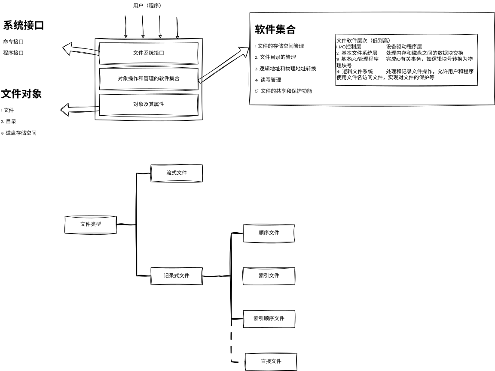

# 文件管理

## 概要（不是目录）
### （一）文件
1. 文件的基本概念
2. 文件元数据和索引节点(inode)
3. 文件的操作
	建立，删除，打开，关闭，读，写。
4. 文件的保护
5. 文件的逻辑结构
6. 文件的物理结构

### （二）目录
1. 目录的基本概念
2. 树形目录
3. 目录的操作`
4. 硬链接和软链接

### (三）文件系统
1. 文件系统的全局结构（layout)
	文件系统在外存中的结构，文件系统在内存中的结构。
2. 外存空闲空间管理方法
3. 虚拟文件系统
4. 文件系统挂载(mounting)

## 文件与文件系统（科普向）

#### 数据项 
基本数据项和组合数据项；

#### 记录 
一组相关数据项的集合，描述某一个对象在某方面的属性；

#### 文件 
具有文件名的一组相关元素的集合，分为有结构文件和无结构文件两种；无结构文件被看作字符流；有结构文件则由若干个相关记录组成。

#### 文件的属性例：

1. 文件类型；
2. 文件长度；
3. 文件的物理位置；
4. 文件的建立时间，指最后一次修改的时间；

### 文件名和类型

#### 文件名 
不同操作系统之间有差异；

#### 扩展名 
也叫后缀名，用来标识文件类型，一般使用点与文件名隔开；

#### 按用途分类：
1. 系统文件 大多数只能调用，不能读写；
2. 用户文件 用户的文件如源代码、目标文件、可执行文件和其他数据的文件；
3. 库文件 允许用户调用，不允许修改；

#### 按文件中的数据类型分类

1. 源文件 指源程序和数据构成的文件；
2. 目标文件 指源程序经过编译但是还未链接的目标代码所构成的文件；
3. 可执行文件 链接后的目标代码构成的文件；

#### 按存取类型

1. 只执行文件；
2. 只读文件；
3. 读写文件；

#### 按组织形式和处理方式

1. 普通文件 ASCII码和二进制码组成的字符文件；
2. 目录文件 由文件目录组成的文件；
3. 特殊文件 特指IO设备，系统将IO设备视为文件，只是对文件的操作由驱动程序完成；

### 文件系统的层次结构

### 文件操作

##### 基本操作

1. 创建文件；
2. 删除文件；
3. 读文件；
4. 写文件；
5. 设置读写的位置；

- 文件的打开和关闭

	open 系统将指定文件的属性，从外存拷贝到内存 打开文件表 的一个表目中，然后将表目编号返回给用户；
	close 将该表目删除；  

	打开的操作可以减少每次读写文件的索引查询时间，直接通过该连接得到文件信息；  

	其他操作的系统调用 如对文件属性的设置和获取和目录的创建删除、改变当前目录和工作目录等。
        

## 文件的逻辑结构

- 文件系统高层-文件的逻辑结构（文件组织形式，又称文件组织）：如何将逻辑记录组织成一个逻辑文件；

- 文件系统底层-文件的物理结构（文件存储结构）：如何将文件存储在外存上；

大体分为两种：
#### 无结构文件，即流式文件，字节为单位
    
#### 有结构文件-按组织方式分类

**顺序文件** 按某种顺序排列记录的文件，记录可以是定长记录或变长记录；
**索引文件** 为可变长记录文件建立一个索引表，每个记录一个表项；
**索引顺序文件** 为每个顺序文件建立一张索引表，每个表项只是一组记录中的第一个记录；

### 顺序文件

- 排列方式

	串结构:记录的顺序与关键字无关，通常是按存入时间进行排列的，检索费时，需要从头查找；  

	顺序结构:按指定的字段作为关键字排列，检索时可以使用查找算法提高检索效率；

- 优缺点

	批量存取时顺序文件的存取效率最高；  

	需要查找或修改时，效率一般；  

	增删时较为困难，为此可以增加一个运行记录文件或事务文件，存储增删改的信息，每隔一段时间将记录文件与主文件合并；

### 记录寻址

- 隐式寻址

	使用读写指针来定位读写位置，读写时对于定长记录的顺序文件只需加一，不定长记录需要读出记录的长度后再加上；

- 显示寻址

	提前计算出要访问的记录的地址实现随机访问，但是变长记录不适用；

- 关键字寻址

	用户指定一个字段作为检索的关键字，通过该关键字查找记录项；  
	对文件目录的检索是基于关键字进行的。

### 索引文件

为变长记录文件建立索引表，表项包含索引号、长度、指针，索引表按关键字排序，本身也是一个顺序记录文件；  
为了满足多种查询的需求，可以为一个文件建立多个索引表，每个表按照可能成为检索条件的不同关键字排序。

### 索引顺序文件

在顺序文件的基础上增加了两个新的特征：引入索引表和增加了溢出文件，溢出文件用来记录新增加的、删除的和修改的记录；  

首先需要将文件中的记录分组，索引表记录每组第一个记录的地址作为表项；  

如果文件记录项较大，可以建立二级索引，在原有一级索引的基础上为一级索引表分组然后建立每组第一项的二级索引表项。  

### 直接文件和哈希文件

- 直接文件 可以根据给定的键值直接得到记录项的物理地址，这种关键字到物理地址的转换称为键值转换。

- 哈希文件 一种直接文件，使用哈希函数获取记录项存储地址，实际使用时一般是映射到目录表，根据目录表项获取对应的物理地址。

## 文件目录

### 文件控制块
      
##### 基本信息

1. 文件名 符号名；

2. 文件物理位置 指示文件在外存上的位置，包括存放文件的设备名，在外村上的起始盘块号，占用的盘块数或字节数的文件长度；  

3. 文件逻辑结构 指示文件是流式文件还是记录式文件、记录数、定长记录还是变长记录；  

4. 文件物理结构 指示文件是顺序文件、索引文件或链接式文件；  

##### 存取控制信息

文件的存取权限：文件主的存取权限以及核准用户的和一般用户的存取权限；  

##### 使用信息类

文件的创建时间，上一次修改时间，当前使用信息等；  

### 索引节点

将文件描述信息单独形成索引节点，文件目录中的表项只存放文件名和索引节点的指针；  

每个文件有唯一的磁盘索引节点；当文件被打开时，将磁盘的索引节点拷贝到内存中，并增加一些其他内容，称为内存索引结点；  

### 文件目录

1. 单级文件目录  
            
	缺点是查找速度慢、不允许重名、不便于实现文件共享；  

2. 两级文件目录  

	在主文件目录下为每个用户建立单独文件夹；  

3. 树形文件目录  

	允许用户创建多级子文件夹，也就是现在常见的方式；  

## 文件共享

文件共享方式发展了很多方法，常见的共享方式有这两种：  

- 有向无环图的方式

	可使用索引结点来实现，将不同目录中的某一索引结点编号指向同一索引结点，就可以在这几个目录下访问同一文件。  

- 符号链接方式  

	使用特殊类型的LINK文件，该文件中不存实际的文件内容，而是只存储被链接文件的文件路径，这样用户在访问时操作系统通过这个路径跳转到该文件进行读写；
	由于需要额外访问次数，所以会增加开销，并且需要为链接文件独立建立索引结点，尽管只是一个简单的链接。  

	符号链接的方式不仅应用在常见的文件系统中，比如计算机网络中的HTML文件常使用连接符来链接到网络上的其他文件。  

## 文件保护

### 保护域 Protection-Domain

文件访问中有访问权和保护域的概念，访问权就是对某一对象的读写权限等，保护域是指一系列的对某些对象的访问权；  
通过规定保户域可以方便地管理进程运行时的资源访问权限。  
并分为两种联系方式：  

##### 静态联系

一个进程只对应一个域，这种情况下进程的权限在运行期间是固定的，可能造成资源的浪费；  

##### 动态联系

在运行期间不同时期可以联系不同的域，比如输出阶段使用的域保护输出设备的访问权，输入和运行可以不需要使用输出，就可以联系其他域，提高资源利用效率。  

### 访问矩阵

用来描述系统的访问控制，横纵坐标分别设为对象和域，各个成员就是某一个域中对某一对象的访问权限。  

在此基础上可以增加域切换权限，即在对象的维度末尾增加域为对象，这样矩阵中的每个域不仅记录了对对象的权限还可以记录对某个域的切换权限，换句话说就是，记录了进程处于每一个域时 可以切换到的其他域有哪些。  

除了基本的读写执行权外，还可增加其他特殊权限：  

- **拷贝权** 在原有权限上加上标记，表示该权限可以扩展到同一对象的其他域中；  
- **所有权** 表示该域拥有对该对象的所有权，可以管理编辑其他域中的对该对象的访问权限；  
- **控制权** 该权限记录在矩阵中以域为对象的部分，表示处于域中的对象可以管理编辑该对象域对所有对象的访问权；  

访问矩阵在实际情况中大概率是稀疏的，因此会将其拆开存储的方式，分为访问控制表和访问权限表：  

- **控制表** 按对象划分，表示该对象在各个域中的被访问权限，并删除了空项；  
- **权限表** 按域划分，表示处于该域中的进程对各个对象的访问权限，共三个字段：*对象类型*、*访问权限*和*对象指针*，访问权限表一般是不允许直接被用户或进程访问的，只有通过合法性检查的程序才能访问；  

# 磁盘存储管理

## 文件在外存中的组织方式

常用的文件组织方式有如下三种：  

### 连续组织

也叫连续分配方式，也就是为一个文件分配邻接连续的盘块，通常位于同一磁道上，读写时不需要移动磁头；  
与内存的连续分配方式一样，容易产生外存碎片，可以使用*紧凑*的方式合并碎片，但是花费的时间远大于内存的紧凑；  

### 链接组织

这种方式允许文件分散地存储在不同盘块中，通过盘块的链接指针连接起来，参考链表，又分为隐式链接和显示链接：  

- **隐式链接** 文件目录中指出文件的第一个盘块和最后一个盘块（当然结点可以不止一个盘块，可以将多个连续的盘块作为分配单位，称为一个簇，但是会增加碎片的大小），参考循环链表；盘块中的指针需要占用存储空间，且与链表一样不能随机访问；  

- **显示链接** 将所有文件的链接指针存放在一张独立的表中，放在*内存*中，表的序号即为物理盘块号，存储的指针域为盘块号，查找过程是在内存中进行的，所以速度较隐式链接大大提高，这张表称为*文件分配表* FAT，File-Allocation-Table；  
FAT技术由FAT12发展到FAT16，最后到FAT32，数字表示簇的空间地址位数，后面又出现了64位的NTFS，New-Technology-File-System.  
NTFS中的存放文件指针的表称为*主控文件表*MFT，Main-File-Table，每行长度固定1KB，每行称为*元数据*或*文件控制字*；  

### 索引组织

在访问某一文件时，需要将MFT全部调入内存才能获得该文件的所有盘块号，索引组织方式则通过将同一文件的盘块分布信息集中起来，在打开文件时仅需要调入该文件的部分即可；  

集中起来的信息称为*索引表*或*索引块*，记录该文所有的盘块号，按顺序放置，建立文件时在文件的目录项中仅需填上索引块指针。  

- **多级索引** 大文件的盘块号较多，为此需要分配较多的索引块，此时可以建立多级索引，由一级索引存储二级索引的指针，以此类推，但是多级索引需要多次获取索引表，会增加磁盘的IO次数；  

- **增量式索引** 如果同一使用多级索引的方式显然效率低下，为此应该对不同大小的文件使用不同的访问方式：  
	1. 小文件 可以直接将盘块地址填入*文件控制块*FCB或*索引结点*中，UNIX System V中存放在索引节点中，地址由13位组成，设置10个直接地址(addr0~addr9)，也叫直接盘块号；  
	2. 中等文件 使用单级索引的方式，从FCB中获取索引块，UNIX System V中为中等文件额外设置一个一次间址块(addr10)，指向索引块；  
	3. 大型文件  使用多级索引，称为多级间址，UNIX System V 中大型文件除10个直接地址和一个一次间址外，还有一个二级间址(addr11)和一个三级间址(addr12)；

## 存储空间管理

简单来说就是 使用情况的记录 和 分配回收方式，下面简单介绍三种  

### 空闲表和空闲链表法

- **空闲表法** 将空闲区记录在一个表格中，如*第一空闲盘块号*字段和*空闲盘数*字段；  

- **空闲链表法** 以链接的方式记录空闲盘，参考内存管理中连续分配方式的空闲链，以盘块为基本结点的称为*空闲盘块链*，允许多个连续空闲盘为一结点的称为*空闲盘区链*；

### 位示图法

- 位示图

	位示图利用0/1表示磁盘块的使用情况，比如 1 表示已分配， 0 表示空闲；  
	使用一个n\*m的矩阵表示所有磁盘块，n\*m即表示磁盘块数。

	- 位示图占用空间小，可以将其全部保存在内存中，常用于微/小型机中。

### 成组链接法
这个讲的通俗易懂：[里昂408](https://www.bilibili.com/video/BV1Ly5Z6bEZx?t=380.9&p=141)

- 简单来说，成组链接法适用于大型的系统，由于存储空间大的系统中空闲块数会很多，空闲表和链表都会很长，占用较多空间；  

- 分配过程，就是将第一组的栈顶元素出栈，作为被分配的盘块
	- 当栈中空闲盘块全部分配完后（注意此时还有一个指向下一组的栈的指针），若又请求分配盘块，则将此时栈顶所指的盘块的内容复制过来，然后就可以将这个盘块（原第二组的栈）分配出去了，因为它保存的所有信息已经转移到第一组的栈中了，原先的第二组就成为了第一组；

- 回收过程，就是入栈
	- 当栈满了，而又需回收一新盘块，就将栈中所有内容复制到新的盘块中，并清空栈将计数置1，底部指针指向该新盘块号，即新回收的盘块号代替了原先的第一组栈，现在作为第二组栈。